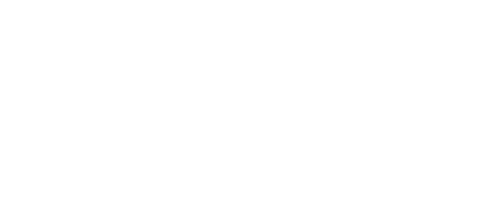

    

access: [snakr.com](https://snakr-im.vercel.app/)

# 🗂️ About

**Snakr** é uma plataforma de **centralização de bibliotecas de jogos**, criada para unificar, organizar e exibir todos os jogos de um usuário em um único lugar, independentemente da plataforma de origem.

A aplicação vai permitir conectar contas de serviços como **Steam, Epic Games e outras**, reunindo jogos, conquistas, status e atividades em uma interface moderna, rápida e focada em experiência do usuário.

# 📄 Purpose & Vision

- **Propósito:**  
  Eliminar a fragmentação entre plataformas de jogos, oferecendo um **hub único** onde o jogador possa visualizar sua biblioteca completa, acompanhar progresso e interagir socialmente.

- **Visão de Longo Prazo:**  
  - Tornar-se o principal **game hub pessoal** do usuário.  
  - Centralizar bibliotecas, conquistas, tempo de jogo e atividades.  
  - Oferecer recursos sociais semelhantes a plataformas tradicionais, porém de forma unificada.  
  - Evoluir para um ecossistema extensível com integrações contínuas.

# 📑 Technical Architecture

| Camada | Tecnologia / Ferramenta |
|---|---|
| Frontend | React, React Hooks, React Router, CSS customizado |
| Backend | Node.js, Express, API REST |
| Integrações | APIs externas (Steam, Epic Games, etc.) |
| Hospedagem | Vercel |
| Autenticação | OAuth / Tokens de acesso |
| Gerenciamento de estado | Hooks + armazenamento local |
| Deploy | CI/CD automatizado |

A arquitetura foi pensada para permitir **novas integrações de plataformas** sem impacto direto na base do sistema.

# 📋 Future Roadmap

- ✅ Estrutura base do front-end e back-end  
- ✅ Deploy automatizado na Vercel  
- 🔐 Autenticação completa com plataformas externas  
- 🎮 Sincronização automática de bibliotecas  
- 🏆 Conquistas globais e comparativos entre amigos  
- 💬 Chat em tempo real e sistema de presença  
- 📊 Estatísticas avançadas de gameplay  
- 🛡️ Segurança, limites de API e controle de tokens  
- 📱 Aplicação mobile

# 🫱🏻‍🫲🏾 Join the Project

O **Snakr** está aberto a colaborações com desenvolvedores interessados em:

- Frontend (React / UX)  
- Backend (Node.js / APIs / Integrações)  
- Arquitetura e performance  
- Experiência social e features multiplayer

### 📬 Entre em contato

# 📜  License

Este projeto, **Snakr**, é um software proprietário e todos os direitos são reservados a Leonardo Silva.

### O que isso significa na prática?

- **Uso Restrito**: O uso, modificação, distribuição, engenharia reversa ou qualquer outra forma de exploração do Snakr é estritamente proibida sem a permissão prévia e por escrito de Leonardo Silva.

Para mais detalhes, leia o arquivo completo de licença: [LICENSE](./LICENSE).

# 👥 Credits & Contributors

O desenvolvimento do **Snakr** é fruto do trabalho colaborativo de pessoas dedicadas que acreditam no potencial de uma IA especializada em matemática.

[Leonardo Silva](https://www.linkedin.com/in/leeosilvp/) | Fundador do projeto e **Desenvolvedor Principal (Lead Developer)** responsável pela arquitetura, implementação e visão estratégica do Snakr.

  
All your games. One place.

